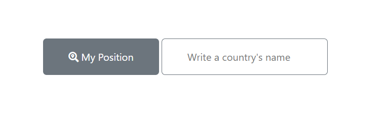
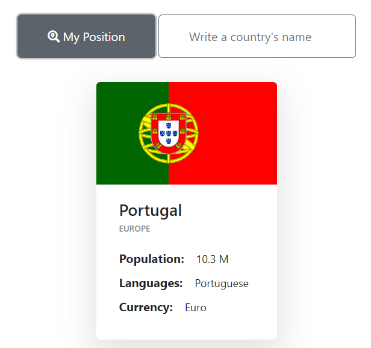

<!-- PROJECT LOGO -->
<br />
<div align="center">

</div>

<!-- GETTING STARTED -->
## Getting Started

### Installation
1. Clone the repo
   ```sh
   git clone https://github.com/jfilipeferreira96/async-try-catch-country-api.git
   ```
2. You can now run the project by opening index.html


<p align="right">(<a href="#top">back to top</a>)</p>

<!-- ABOUT THE PROJECT -->
## About The Project
Basic project that uses async await with the **try catch method**.

Upon pressing the button the applicattion gets the browser geolocation coordinates and consumes 2 API.

By using the input the app consumes only 1 API and returns some information about the country.

<p align="center">




<p align="right">(<a href="#top">back to top</a>)</p>


